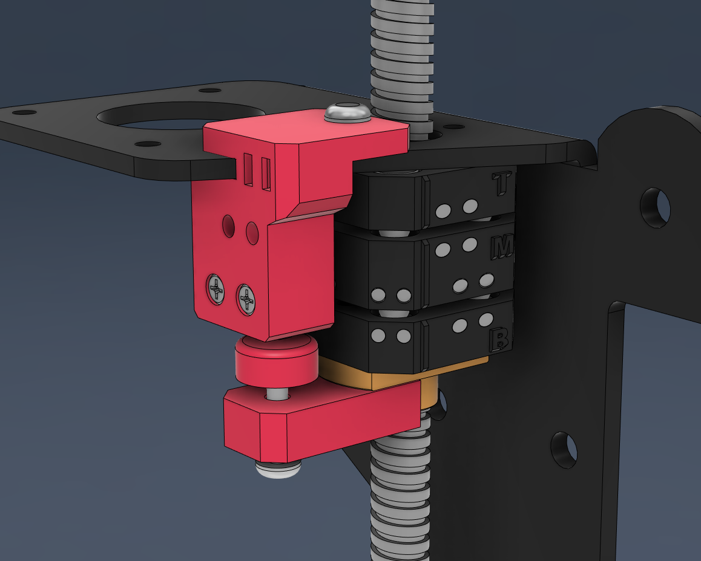
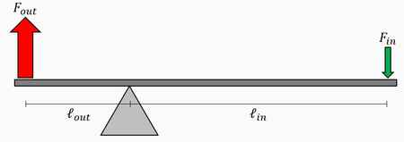
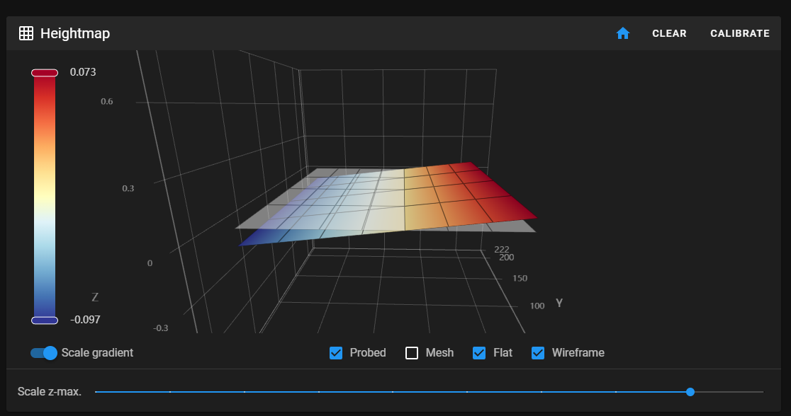
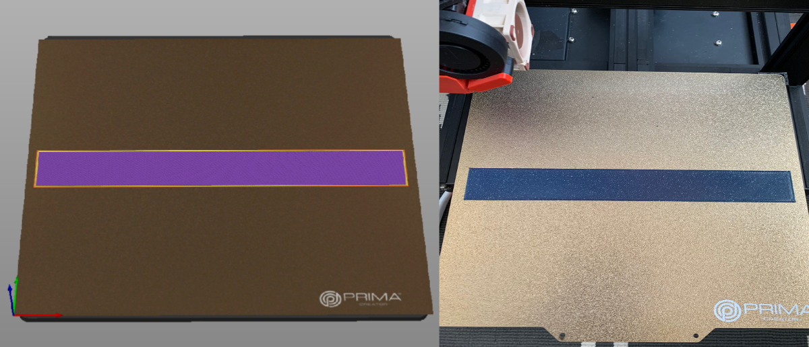
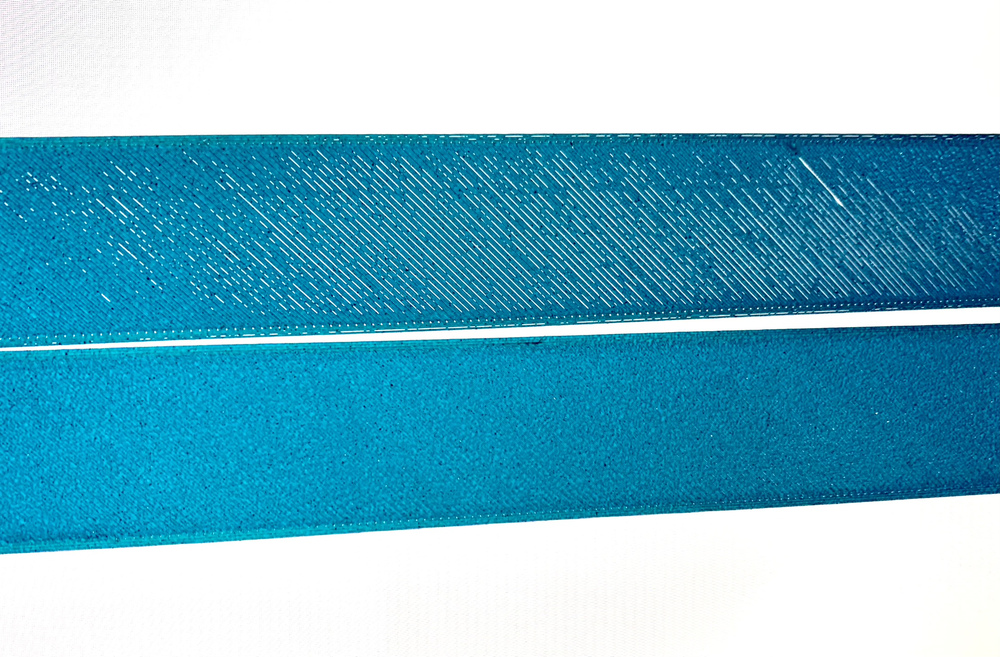
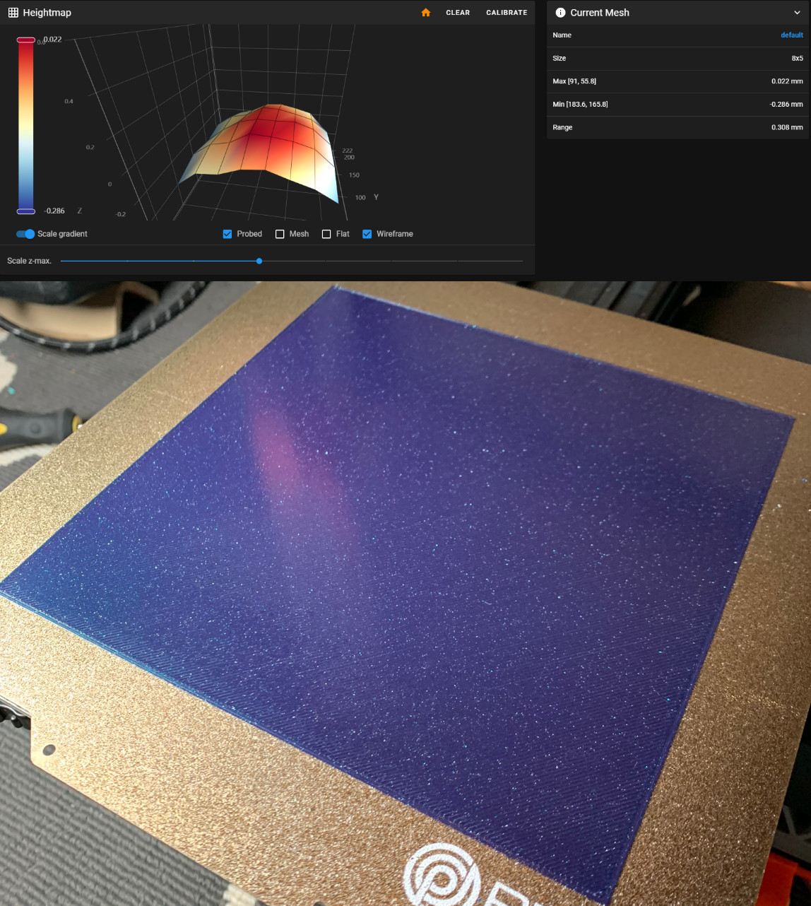

# BackTap Probe

This is a Klipper extension that provides support for the [BackTap Probe](https://www.printables.com/model/456877-back-tap-alpha-nozzle-probe-endstop-ender-3)

  
**Why is this needed?**

For the BackTap Probe to be accurately used for bed meshing, it is required to add an offset along the X axis.  
This is due to the mecanical lever factor, where the actuation is triggered by a moving point along a lever (X gantry).
 
 

This extension adds the possibility of defining two deviation offsets alongside the X axis, relative to the home position. These are setup once and doesn't have to be changed when modifying the Z offset. 

***The home Z offset is not affected by this code.***

 
 

This extension is transparent and compatible with all functions inside Klipper. 
It functions like a normal probe with no additional macros required to make use of it.
  

## Installation:

1. Clone this repo to your home directory and install the extension using the following commands:
<pre><code>
cd ~
git clone https://github.com/lhndo/BackTap-Probe.git
./BackTap-Probe/install.sh
</code></pre>

2. To keep this extension up to date, add this section to "moonraker.conf"

<pre><code>
[update_manager client back_tap_probe]
type: git_repo
path: ~/BackTap-Probe
origin: https://github.com/lhndo/BackTap-Probe.git
managed_services: klipper
primary_branch: main
</code></pre>

  
## Klipper Configuration:

### Probe Configuration
***Add the following lines to your printer.cfg, and remove any previous probe section***

<pre><code>
#--------------- Back Tap Probe ---------------

[back_tap_probe]

#Probe Settings
pin: ^PA4          # Endstop pin of the BackTap probe. Needs ^ in front of the pin.
x_offset: 0
y_offset: 0
z_offset: -0.217      
speed: 4.0
lift_speed: 10.0
sample_retract_dist: 2
samples: 1
samples_tolerance_retries: 6
samples_result:average

#Back Tap Settings
use_deviation: True      # Enables the deviation correction along the X axis
home_x_pos: 115          # Should match your safe_z_home setting
home_y_pos: 115          # Should match your safe_z_home setting
deviation_min_x_pos: 20     # Position of left deviation measurement point. Ideally 20mm from the edge of the bed.
deviation_max_x_pos: 210    # Position of right deviation measurement point. 
deviation_min_x: -0.08     # Left deviation offset 
deviation_max_x: 0.08      # Right deviation offset 

#Calibration settings
calibration_speed: 150
calibration_samples: 3
calibration_lift_speed: 12

</code></pre>

### Settings
***Modify the following lines in your configration, if relevant.***

<pre><code>
[stepper_z]
endstop_pin: probe:z_virtual_endstop
position_min: -2
homing_speed: 4
second_homing_speed: 4
homing_retract_dist: 3

[safe_z_home]
home_xy_position: 115,115
speed: 80
z_hop: 10
z_hop_speed: 5

[screws_tilt_adjust]
horizontal_move_z: 2

[bed_mesh]
horizontal_move_z: 1

</code></pre>

  
## Calibration Procedure

#### What needs to be calibrated?
deviation_min_x  
deviation_max_x 

The default values are calibrated based on my own testing on a Creality Ender 3 V2, and should work, or provide a good starting point for fine adjustments, if needed.

#### What do they do?

They provide two relative offsets at the left and right of the Z home possition (ideally the center of the bed). 

Deviation_min_x_pos, and deviation_max_x_pos determine the place of measurement of the deviation.  These are interpolated from the Z home location to beyond their set value along the X axis 

Once set these, don't have to be adjusted whever you change the Z offset.

## Base setup

Define the following values if needed:
<pre><code>
home_x_pos: 115                 # Set to be the same as your safe home X position
home_y_pos: 115                 # Set to be the same as your safe home X position
deviation_min_x_pos: 20         # Left offset measuring point. Recommended 20mm off the edge
deviation_max_x_pos: 210        # Right offset measuring point. Recommended 20mm off the edge   
</code></pre>
  

## Calibration Method A

***This is the recommended method to determine your deviation settings.***

1. Start with the base default values.
2. Make sure you Z offset is well set and won't need to be adjusted during the calibration print.
3. Generate a bed mesh 
4. Slice and print one layer that covers the bed across the X axis using the bed mesh generated.
   

   
   5. Verify the **left side (deviation_min_x)** and **right ride (deviation_min_x)** extremes, against the center of the print.
   6. If the nozzle was too far away from the bed compared to the center, decrease the deviation for that side in increments of -0.01 
   7. If the nozzle was too close, scraping the layer compared to the center of the print, increase the deviation offset for that side in increments of +0.01
   8. **Re-generate the bed mesh** and repeat the process until the print is consistent all across the X axis
   

   

## Calibration Method B

This method involves calibrating the offsets using the paper test, and can be a less accurate.
These results should be validated with a print like the one in the previous section.

Add the following macros to your configuration

### Calibration Macros

<pre><code>
#--------------- Back Tap Probe - Calibration Macros ---------------

[gcode_macro BTP_CALIBRATE]
gcode: 
  G28 Z
  BACK_TAP_CALIBRATE

[gcode_macro BTP_POS_1]
gcode: 

  BACK_TAP_MOVE POS=1

[gcode_macro BTP_POS_2]
gcode: 

  BACK_TAP_MOVE POS=2

[gcode_macro BTP_POS_3]
gcode: 

  BACK_TAP_MOVE POS=3

[gcode_macro BTP_POS_4]
gcode: 

  BACK_TAP_MOVE POS=4

[gcode_macro BTP_POS_5]
gcode: 

  BACK_TAP_MOVE POS=5

[gcode_macro BTP_PROBE_ACC]
gcode:
   PROBE_ACCURACY
</code></pre>

1. Set ***use_deviation: False*** in your ***[back_tap_probe]*** section
2. Home your Z axis and tune your Z_offset by using the paper test. Save the value and restart Klipper.
3. Run the BTP_CALIBRATE macro. This generates a pseudo bed mesh at precise intervals from deviation_min_x_pos to deviation_max_x_pos.
4. Run the BTP_POS_3 macro. This places the nozzle in the center of the bed. Re-check your Z_offset using the paper test.
5. Run BACK_TAP_MOVE POS=1. This places the nozzle at deviation_min_x_pos, and uses the pseudo bed mesh to place the nozzle at the same offset from the bed as in POS 3 (center).
6. Check the Z offset using the paper test. Adjust the Z_offset using babystepping until it matches the one at the center of the bed. Make note of the value. It should be in the negative range i.e. -0.06. 
7. Run BACK_TAP_MOVE POS=5. This places the nozzle at deviation_max_x_pos. 
8. Do the same as step no. 5. The resulting value should be in the positive range
9. Change deviation_min_x and deviation_max_x in your config to the found values from POS 1 and POS 5 respectively. 
10. Set ***use_deviation: True*** in your ***[back_tap_probe]*** section, generate a bed mesh, and perform a test print similar to Calibration Method A

 

 
 

*Enjoy!*